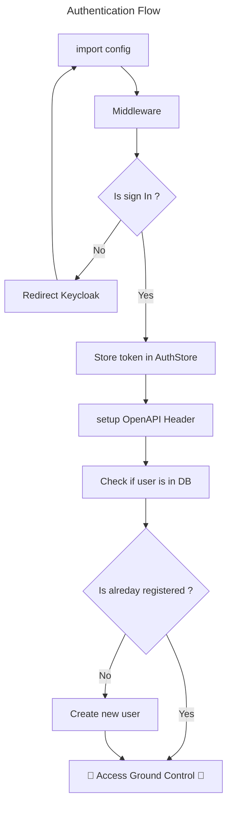

# Nuxt 3 Minimal Starter

Look at the [Nuxt 3 documentation](https://nuxt.com/docs/getting-started/introduction) to learn more.

> **IMPORTANT**  
> Make sure to have the last version of BOTH repositories locally installed and up to date before running `docker compose up`. 
> To do that, go to your local develop branch using `git checkout develop` and then `git pull` on both frontend and backend directories.
> The 2 application needs to interact with each other so you need to work. 

## Deployment
All the variables are initialize from the [config.json](./public/config.json) file.
List of variables that can be override in production:

- apiBasePath : API address for the browser. In dev it's `localhost:8000`
- authorityUrl : Keycloak realm url to setup authentication. In dev it's `http://localhost:9080/realms/ground-control`
- cliendId : Identifier for Keycloak to know it's the frontend that reache it. In dev it's `web_app`
- version : Actual version of Ground Control. By default set to `1.0.0`

## Setup

Make sure to install the dependencies:

```bash
# npm
npm install

# pnpm
pnpm install

# yarn
yarn install

# bun
bun install
```

## Development Server

Start the development server on `http://localhost:3000`:

```bash
# npm
npm run dev

# pnpm
pnpm run dev

# yarn
yarn dev

# bun
bun run dev
```


## Running unit tests

`npm run test` to execute the unit tests via vitest (`vitest`: the default command).
`npm run coverage` to run and get a coverage report of unit tests (`vitest run --coverage`: the default command) .
 
These commands are specified in a script in `package.json` 
To make your own vitest unit tests configuration , you may use `vitest.config.ts` file to set up various options like environment, outputFile ... 

## Running eslint

`npm run lint` to execute the lint (`eslint .`: the default command).
`npm run lint:fix` to run and fix lint warnings and errors (`eslint . --fix`: the default command) .

These commands are specified in a script in `package.json`
To make your own eslint configuration , you may use `eslint.config.mjs` file to set up desired config.

## About authentication

<div align="center">


</div>
The authentication flow of the application is handled by Keycloak. All the variable needed for configuration are in the [config.json file](./assets/config.json). It contains the address of the Keycloak container and the one from the API. The file is loaded at the application creation in [this plugin](../plugins/backend-openapi-config.ts)
In development mode, you can see all the tokens and user information in Pinia tab of the Nuxt DevTool. These infos are also store in a WebStorageSession which means the user is still connecting after closing the application tabs on its browser.

The global middleware of the application redirect any incoming user who are not logged. After login in the Keycloak page, user gets redirected to `/auth` page where the actual sign in function is called. Finally, he comes back to the root of the application.

The access token, used in every API call to the backend application, may eventually expire during long session. The page `/silent-refresh` allow user to refresh its access token using the refresh token. This route is called automatically upon access token expiration.


## Production

Pour compiler le projet, utilisez la commande `npm run build`. Celle-ci génère un répertoire dist contenant les fichiers à déployer avec Nginx

